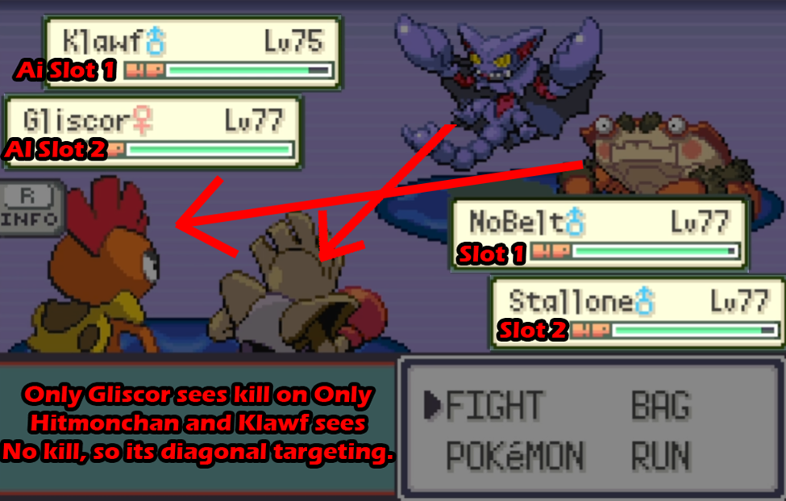
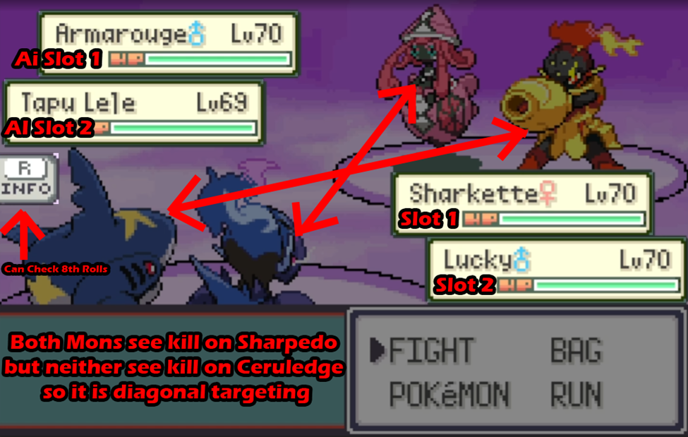
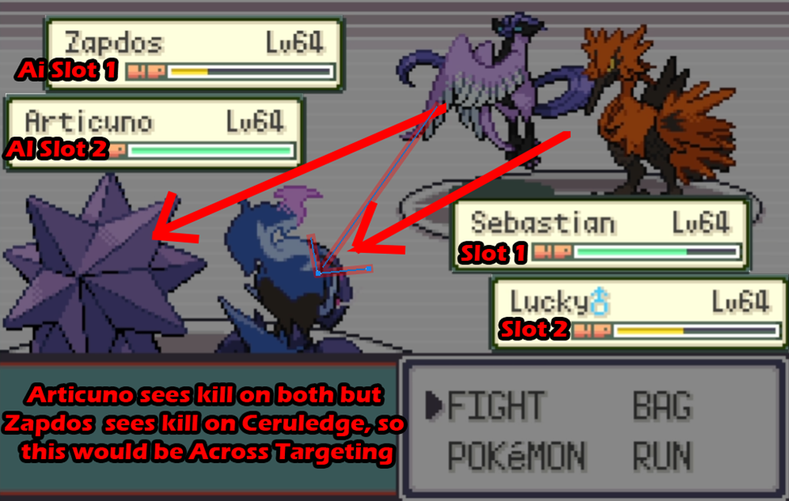
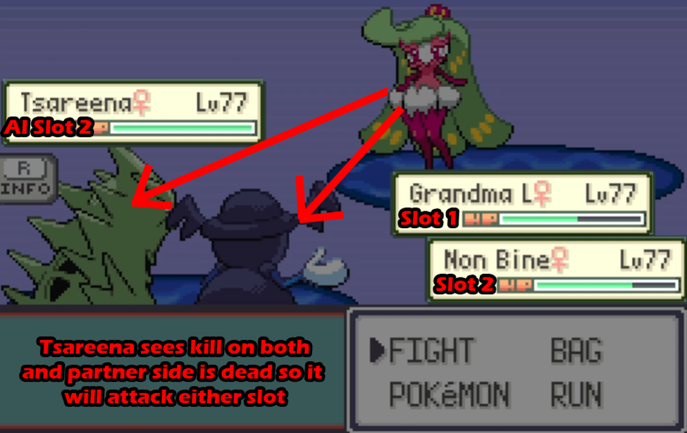

## Double Battle Targeting
AI will generally never have both Pokemon attack the same slot if one of the AI’s Pokemon has a kill. Exceptions are [moves](https://github.com/rh-hideout/pokeemerald-expansion/blob/master/src/data/moves_info.h) that target the user, opponents field or all mons.

As a note, Player’s Slot 1 is their left (First mon in party), where the Opponents Slot 1 will be to the player’s right (First mon in enemy party)

    AI Side:     Slot 2 Slot 1
    Player Side: Slot 1 Slot 2

**Scenario 1:** If AI slot 1 sees kill on both player slot 1 and 2 and AI slot 2 sees no kills, AI mons will target diagonally. Likewise the reverse is true if AI Slot 2 sees kill on both slots and slot 1 sees no kill.

**Scenario 2:** If both of AI’s pokemon see kill on both of the players Pokemon, this will be diagonal targeting. Likewise, if both of the AI’s pokemon see kill on the same target and neither see kill on the other slot, it will be diagonal targeting.

**Scenario 3:** If AI slot 1 sees kill on both player pokemon (slot 1/2) and AI slot 2 sees a kill on Player slot 1, Slots will target directly across. Likewise the reverse is true if AI Slot 2 sees kill on both slots and AI Slot 1 sees kill on only Player Slot 2 (Flip the diagram).

If AI Slot 1 sees kill on Player Slot 2 and AI Slot 2 sees kill on Player Slot 1, Slots will target directly across

**Scenario 4:** If AI has only one mon left and sees kill on both slots, it will choose a target randomly with whatever move sees kill on respective slots. If it sees a kill on only one slot, it will always go for that slot.

## Post KO Switch in
  * Palafin-Zero outspeeds current player mon: + 8
  * AI Mon faster and can faint target: + 7
  * AI Mon faints target and is not dead to player: +6
  * AI Mon faster and can faint with the same amount of hits or less the opposing mon: + 5
  * AI Mon slower and can faint ai with less hits then opposing mon: +4
  * AI Mon faster: +3
  * AI is slower and dies in one hit +1
  * Anthing else is +2

## Sturdy / Focus Sash / Disguise
  * AI is aware of those items (ability) and will include them in the number of hits calculation
  * It will correctly see multi hit moves a breaking endure type effects on a kill unless it is Dragon Darts in doubles

## Speed
  * AI sees a speed tie, Quick Claw and Quick Draw as faster
  * Priority moves on player (includes effects that increase priority) are not seen by AI

## Scoring on kills (additive)
  * Move can kill: +4
  * hit switch targer (dragon tail) + 2

### Singles only
  * If AI is slower and dead +10 on prio moves
  * If AI is faster and move can kill: + 2 (Priority moves are considred as being faster in this case)
  * If AI can kill with hit escape move (u-turn): 50/50 +2

### Doubles only
  * AI can kill with double target move +2 (e.g. Dazzling Gleam)
  * AI can kill with spread move +2 if partner is dead (e.g. Surf)

## Mid turn switch (Calcs are done with a possible switch in candidate)
  * Never switches in Doubles
  * Never switches if player faints mon with 2 or less hits
  * If AI does no damage 50/50
  * If under Encore 50/50
  * Further conditions if the above apply:
    * If AI has baton pass it will only switch with baton pass
    * If faster and faints player in one hit, +5
    * If faster and faints player in same or less hits, +4
    * If slower and faints player in less hits, + 3
    * If AI faster + 2 (an oversight, will be removed in a later verision. it is the last check so will likely never apply)

## How the AI sees damage
The damage the AI sees is always using the 8th roll of the calculator, it will always select moves and switch in using 8th roll.
  * All calculations are done using the above mentioned roll
  * AI see only damage that it will actually deal. Something like Thunderbolt into Volt Absorb will be seen as 0 damage and receive a -20 score.
  * Two-Turn Moves are seen as zero demage if they can't be used the same turn they charge (if weather or power herb are not present)
  * The AI will see the damage of a 100% crit
  * **Bug**: AI might see one roll lower for gems boosts so the 7th (Might apply to type boosting items so just use the 7th roll to be save)
  * Explosion is treated like a normal move other then that it is a negative move effect

## Tera calcs (Relevant for Tera/Stella Island)
  * The AI sees Tera Blast or stab increased damage as if it did Terastalize when it is possible for the mon to do it (including party)
  * If AI mon has a Tera type while in party or field it will do calcs as if it already terastallized (including Tera Blast)
  * Calcs for Player mon happen only when actually terastallized (including Tera Blast)

## Damage moves scores
  * When AI chooses a move it compares all moves that can do damage against each other and looks for Postive/Negative effects. Moves with a negative effect will be discouraged based on how many hits it will take for AI to faint player mon.
    * Exmaple: If Overheat and Flamethrower have the same number of hits to faint AI Flamethrower gets a plus one score
  * When AI sees a kill with several moves, a move with a positive effect gets +1
  * If several moves with a positive effect are present, all of them get +1
    * Example: If AI sees kill with Night Slash (high crit) and Rock Tomb (rock tomb), it would select one of those randomly
  * If a negative move is present, all non negative moves get +1 based on number of hits (Phase 2 check)
    * Example: If AI sees a 2HKO on player mon with EQ, CC and Raging Bull. Close Combat is considered a negative effect, so both EQ and Raging Bull will get a +1 score

## Multi hit moves (e.g. Bullet Seed)
  * Skill link will always be seen as doing the max amount of hits
  * Loaded Dice is seen as 4 hits
  * Population bomb calcs with 10 hits
  * Other moves are doing the specified number of hits (3 if it is random between 2-5)
  * Triple Axel will calc damage as 20 + 40 + 60 and always the 8th roll so the final roll will also be the 8th

## Positive move effects
  * Double target moves in doubles (spread moves like Surf/EQ only when no partner)
  * Sound moves if user is holding a Throat Spray
  * Crit moves that don't always crit
  * Trapping moves
  * Brick Break type effects if screens are on players side
  * Drain effects if no Liquid Ooze
  * Fell Stinger
  * Pursuit
  * Knock Off
  * Switch target out moves (e.g. Dragon Tail)
  * Damage moves that set up Hazards
  * Guaranteed speed drop moves (e.g. Icy Wind)
  * Self boosting moves (e.g. power up punch, leaf storm with contrary)
  * Note: If more then one move is present with a plus effect then both get the plus one

## Negative move effects (damage moves with a negative side effect)
  * Recoil
  * Moves that would target partner
  * Mind Blown, Steel Beam, Explosion type moves, Final Gambit
  * Recoil on miss
  * All moves that have a negative effect on AI unless they have contrary or hold a white herb (e.g. Superpower)

## Scale Shot (can be considered both a negative and positive depending on other moves)
  * If a negative move is present it is considered to be a positive move
  * If a positive move is present it is considered to be a negative move
  * If neither are present, Scale Shot is considered to have no positive / negative effects

## Move effects:
  * Moves with regular move effects generally get a +2/+3 if they apply. If I list some effects and don't specify a score you can assume that this is true
  * Some effects get a +1 only in some rare instances. That makes them tied with best damage move
  * Moves that target partner get a +10 if conditions apply
  * An AI move that faints the player will have the highest score. Exceptions are TrickRoom, Protect, Palafin-Zero with Flip Turn and specific Double Battle AI quirks (see move effect section).
  * If a move would fail if used by AI it will get a -20

## Status Moves
  * For the following checks order matters
  * If the move would fail the AI wont click it

### Protect (+15 if conditions apply)
  * If either mon has encore, no score increase
  * If AI is faster then both opposing mons, no score increase
  * If AI used protect last turn, no score increase
  * If it's the first turn for AI mon on the field and one opposing mon can faint it, 100% score increase
  * If not first turn and any opposing mon can faint, 50/50 score increase
  * The rules of a double battles still apply. Meaning if AI targets a player mon to kill it, it will not go for protect if the target has no move to faint the AI mon

### Hazards (including Stone Axe / Ceaseless Edge)
  * If AI faints player in less hits and player has a way to remove hazards, no score increase
  * If AI outdamages and player has a way to remove hazards, no score increase
  * 70/30 in favor of no hazards if player has a way to remove rocks
  * If AI/player has only 3 mons left no score increase
  * AI will only set one layer of hazards for each move/hazard type
  * In any other situation, +3

### Screens
  * If no corresponding category on player, no score increase
  * If player has a BrickBreak type move
    1. if AI faints player faster, no score increase
    2. Otherwise 30% to be increased by +3
  * In any other situation, +3

### Follow me
  * If partner dies to any player mon, +3
  * If both mons on the field have Follow Me only AI slot 1 (right side) will be able to choose follow me

### Speed Control (differes from positive move effect)
  * If AI cant't drop speed, no increase (Clear Amulet, Clear Body, etc.)
  * If AI faster, no increase
  * If AI is still slower (or tied) the next turn, no score increase
  * If AI outdamages player, no score increase
  * If player resists move, no score increase unless the move + best damage move kill next turn
  * In any other situation, +3

### Poison
  * If player holds a curing berry AI, no score increase
  * If AI is faster and faints player in 2 or less hits, no score increase
  * If player needs 3 or more hits to faint AI, +3
  * Otherwise +3, 100% if's first turn and 50/50 in any other situation

### Burn (Will-O-Wisp)
  * If player holds a curing berry or has no physical move, no score increase
  * If AI is faster and the best damage move is physical, +3
  * Otherwise +3, 100% if's first turn and 50/50 in any other situation

### Paralysis
  * If player holds a curing berry, no score increase
  * If AI is slower, +3
  * If Player needs 3 or more hits to faint AI, +3

### Tailwind
  * No score increase in doubles if only one mon left
  * +10 on Whitney if no Tailwind is set up
  * If Slower +3 (checks average in doubles)

### Weakness Policy (+10)
  * If it isn't the first turn for either mon, no score increase
  * If partner is faster, has a move that would trigger the policy and need 4 or more hits to faint partner

### Set up except Belly Drum (+2/+3 mostly irrelevant difference)
  * If player outspeeds and two taps, AI is not going to set up
  * If AI is faster but you one tap it, it isn't going to set up
  * If it set up the previous turn and is faster + can 2 tap it isn't going to set up
  * If it can kill the player it isn't going to set up
  * If it dies to secondary damage this turn AI does not set up
  * If player has opportunist / unaware it is not going to set up
  * In any other situation it sets up
  * Leaf Storm, Overheat, Draco Meteor and Superpower are set up moves with Contrary

### Increase crit rate +3 (e.g. Focus Energe)
* If ai faints to player in 2 or less hits (applies to both mons in doubles), no increase.
* Increase if Super Luck, Sniper, Scope Lens or or high crit move is present

### Tailwind
  * No score increase in doubles if only one mon left
  * If Slower +3 (checks average in doubles)
  * +15 on Whitney it Tailwind is not set up yet

### Destiny Bond
  * If player can faint AI and AI faster, +3

### Belly Drum check
  * No set up if AI faints regardless of speed or already increased stats, otherwise +3

### Mirror Coat / Counter
  * No icnrease if AI dies to move
  * No increase if AI has Mirror Coat (Counter) and player has no special (physical) move
  * Otherwise 50/50 to get a +3

### Recover / Heal AI (+3)
  * If plyaer does only 50& or less of the current hp, no score increase
  * If AI faster, 30% of the time no score increase
  * Score increase if heal amount + current HP are higher then best player damage and damage equal or higher current hp

### Trap (+2)
  * If player needs 4 or more hits to faint ai trapping moves get an increase
  * Trapping moves that don't do damage are not included

### Attract (+2)
  * If AI faster and faints player in 2 or less hit, no increase
  * 100% to increase score on the first turn if opposite gender, otherwise 50/50

### Future Sight
  * Seen as a zero damage move (including party) but score is considered neutral unless a future attack is active
  * If AI is faster and faints to player +3
  * If AI is slower and faints in 2 hits to player +3

### Sucker Punch
  * After the first time AI tried to use Sucker Punch it can get a -20 score decrease 50% of the time

### Decorate
  * +10 on the first turn of user, otherwise 30% of the time

### Beat Up
  * +10 if partner has rage fist or justified and it is first turn of itself or partner

### Skill Swap
  * +10 if beneficial for partner

### Fake Out
  * +3 if it can flinch
  * In doubles it follows the same rules as other moves
  * Does not stack with killing score (only faint score is applied)

### Throat Chop
  * +3 if player has a sound move and it is the highest dmg move

### Salt Cure
  * +2 on first turn of AI mon, 50/50 otherwise

### Substitute
  * No score Increase if player can tage advantage of sub (ability / move not blocked by sub)
  * If slower and after a hit Substitute would fail, no increase
  * Otherwise 50/50 to go for a Sub

### Shed Tail
  * No score Increase if player can tage advantage of sub (ability / move not blocked by sub)
  * If AI has no alive mon in Party, no increase
  * If at 50% hp, no score increase
  * If slower and after a hit Shed Tail would fail, no increase
  * Otherwise increase
