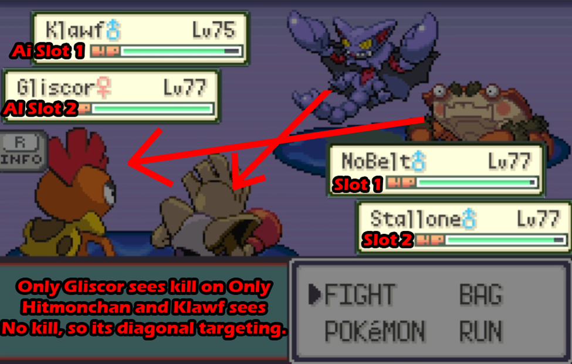
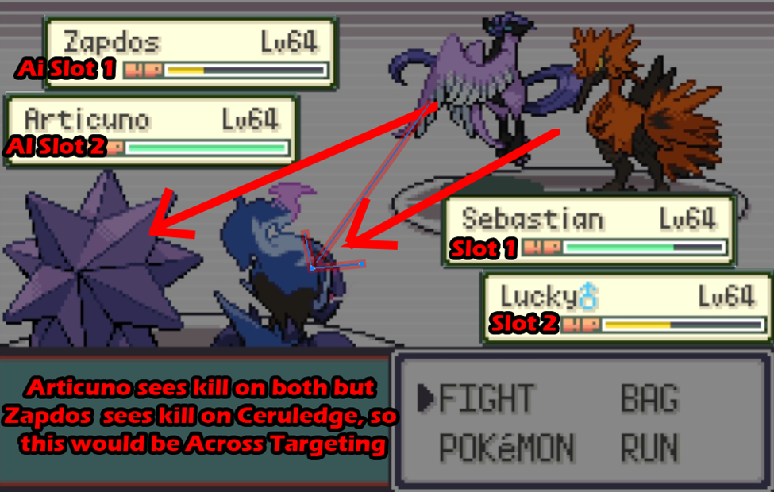
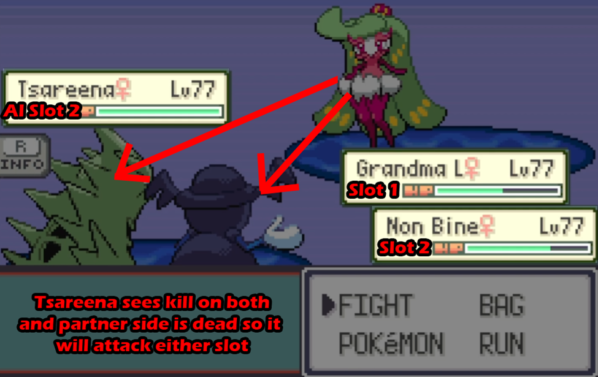

## Double Battle Targeting
AI will generally never have both Pokemon attack the same slot if one of the AI’s Pokemon has a kill. Exceptions are [moves](https://github.com/rh-hideout/pokeemerald-expansion/blob/master/src/data/moves_info.h) that target the user, opponents field or all mons.

As a note, Player’s Slot 1 is their left (First mon in party), where the Opponents Slot 1 will be to the player’s right (First mon in enemy party)

    AI Side:     Slot 2 Slot 1
    Player Side: Slot 1 Slot 2

**Scenario 1:** If AI slot 1 sees kill on both player slot 1 and 2 and AI slot 2 sees no kills, AI mons will target diagonally. Likewise the reverse is true if AI Slot 2 sees kill on both slots and slot 1 sees no kill.

**Scenario 2:** If both of AI’s pokemon see kill on both of the players Pokemon, this will be diagonal targeting. Likewise, if both of the AI’s pokemon see kill on the same target and neither see kill on the other slot, it will be diagonal targeting.

**Scenario 3:** If AI slot 1 sees kill on both player pokemon (slot 1/2) and AI slot 2 sees a kill on Player slot 1, Slots will target directly across. Likewise the reverse is true if AI Slot 2 sees kill on both slots and AI Slot 1 sees kill on only Player Slot 2 (Flip the diagram).

If AI Slot 1 sees kill on Player Slot 2 and AI Slot 2 sees kill on Player Slot 1, Slots will target directly across

**Scenario 4:** If AI has only one mon left and sees kill on both slots, it will choose a target randomly with whatever move sees kill on respective slots. If it sees a kill on only one slot, it will always go for that slot.

