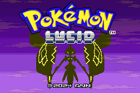

### [Download latest release - v1.1.6c](https://github.com/pkLucid/Pokemon-Lucid/releases/tag/Version%2F1.1.6)

### Pokemon Lucid Changelog v1.1.6c

  * Fixed Fake Out getting an additional +2 if AI mon is faster. Made it tie with faint score
  * Fixed Ogerpon Masks not increasing move base power
  * Fixed AI not seeing boosted Retaliate damage in party
  * Fixed Super candy issue not leveling correctly

### Pokemon Lucid Changelog v1.1.6
  * New title screen (Credits Byonmil)
  * Added appropriate gen5 gym badge (Credits Byonmil)
  * Added signs on the Tera Islands
  * Hopefully finally fixed Revenge / Assurance AI dmg calc
  * Fixed After you not working if there is only one mon left on oppsoing side
  * Fixed Berry Juice sometimes missing timing on residual dmg  
  * Fixed boosting moves that increase score by 2 stages not getting an increase in a few cases
  * Fixed wrong options in box menu
  * Fixed Super Candy lag 
  * Fixed Super Candy deleveling mons if they have a lower level evo while above that evo cap
  * Fixed covert cloak not seen by AI for non flinching (flinching was correctly handled previously)
  * Fixed Follow me inaccuracies (minor AI change. See ai doc for more)
  * Fixed AI not seeing boosted Retaliate damage in party 

### Current known issues
  * If Eject Button ejects into an Intimidate mon Life Orb / Shell Bell will miss timing
  * If a mon targets it's own partner the move will be redirected if the partner faints before it
  * Rapid spin activates before Toxic Debris
  * Very rare rounding error with gems. Ai might see the 7th roll instead of 8th. Could apply to type boosting moves but not confirmed
  * Forces of Nature signature move anims broken (visual only)
  * Visual bug after a mon attempts to switch if Emergency Exit is triggered
